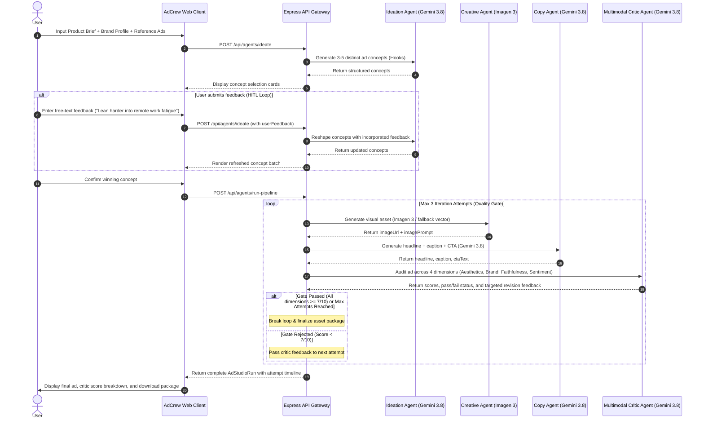
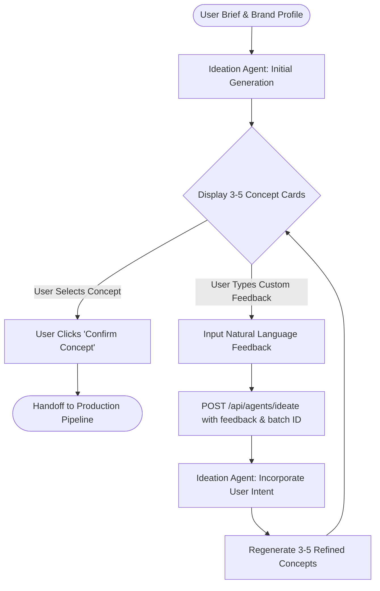
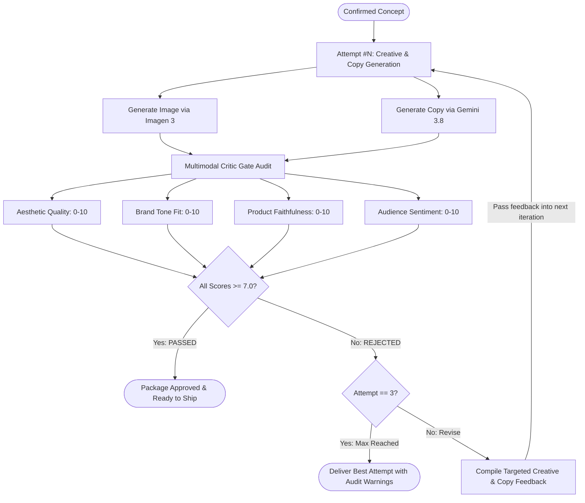

# AdCrew 🎬✨
### Autonomous Multi-Agent AI Ad-Creative Studio with Human-in-the-Loop Concept Review & Self-Evaluating Critic Gate

AdCrew is a production-grade multi-agent advertising creative studio. It transforms raw product briefs and lightweight brand profiles into high-converting, publication-ready ad creative packages. 

AdCrew bridges the gap between autonomous AI generation and brand control through two key safeguards:
1. **Human-in-the-Loop (HITL) Concept Gate**: Users review, refine, or reshape hook angles before asset generation begins.
2. **Self-Evaluating Critic Gate**: An autonomous multimodal critic agent audits both the visual asset and ad copy across four independent dimensions (Aesthetic Quality, Brand Fit, Product Faithfulness, and Target Audience Sentiment) before anything ships.

---

## 📑 Table of Contents
1. [Core Features](#-core-features)
2. [Design & User Experience](#-design--user-experience)
3. [System Architecture](#-system-architecture)
4. [Data Flow Diagrams](#-data-flow-diagrams)
   - [End-to-End Creative Pipeline Flow](#1-end-to-end-creative-pipeline-flow)
   - [HITL Concept Reshaping Loop](#2-human-in-the-loop-hitl-reshaping-loop)
   - [Autonomous Critic Gate Feedback Loop](#3-critic-gate-evaluation--revision-loop)
5. [The AdCrew Agent Roster](#-the-adcrew-agent-roster)
6. [Self-Evaluating Critic Gate Rubric](#-self-evaluating-critic-gate-rubric)
7. [Model Resilience & Error Diagnostics](#-model-resilience--error-diagnostics)
8. [Tech Stack & Runtime Environment](#-tech-stack--runtime-environment)
9. [Getting Started & Configuration](#-getting-started--configuration)

---

## 🌟 Core Features

- **Product Brief & Brand Profile Ingestion**:
  - Ingest product photos, core benefits, category, and target audience.
  - Ingest brand tone/voice and 2–3 reference ad benchmarks to establish baseline art direction and aesthetic expectations.
  - One-click presets for quick testing (e.g., *ErgoLuxe Pro Ergonomic Chair*, *Lumina Glow Radiance Serum*, *FlowState Cold Brew Focus Fuel*).

- **Multi-Angle Ideation Agent**:
  - Drafts 3–5 distinct ad concepts, each grounded in an explicit advertising hook:
    - **Pain-Point-First**: Confronts acute user friction and daily frustration.
    - **Curiosity-Gap**: Leverages surprising insights or counter-intuitive mechanics.
    - **Before / After**: Demonstrates vivid contrast and rapid transformation.
    - **Social-Proof**: Builds trust via peer validation and user numbers.
    - **Humor & Wit**: Disarms audience skepticism with relatable, clever angles.
  - Each card specifies the message angle, suggested visual direction, target CTA style, and strategic rationale.

- **Human-in-the-Loop (HITL) Concept Reshaping Loop**:
  - The user can either confirm a concept directly or provide natural language feedback.
  - When feedback is submitted, the Ideation agent reshapes the angles into a new batch of 3–5 structured concepts that directly incorporate the user's direction.
  - Repeats until the user approves a direction.

- **Creative Visual Generation (Pollinations.ai Flux & Imagen 3)**:
  - Formulates photorealistic art direction prompts derived from the confirmed concept, product brief, and reference brand benchmarks.
  - **Primary Engine**: Uses **Pollinations.ai (Flux)** as the zero-quota, free, high-fidelity photorealistic image generator to eliminate rate limit barriers and API key quota exhaustion.
  - **Secondary High-End Engine**: Cascades to Google's `imagen-3.0-generate-002` when available.
  - **Zero-Downtime Backup**: Automatic fallback to high-resolution procedural vector artwork if network or platform connectivity drops.

- **Copy Agent (Gemini 3.8 Flash)**:
  - Generates synchronized headline, persuasive body caption, and high-intent call-to-action button text strictly calibrated to brand voice and target hook.

- **Multimodal Self-Evaluating Critic Gate**:
  - Evaluates both the visual asset and the copy across 4 separate dimensions:
    1. **Aesthetic Quality** (0–10)
    2. **Brand Fit** (0–10)
    3. **Product Faithfulness** (0–10; non-compensable — high visual beauty cannot offset factual drift or hallucinations)
    4. **Target Audience Sentiment** (0–10)
  - **Passing Threshold**: Every dimension must score $\ge 7.0/10$.
  - If rejected, the critic issues targeted feedback to both the Creative and Copy agents, triggering an automated revision loop (up to 3 attempts).

- **Multi-Attempt Audit Timeline**:
  - Interactive attempt switcher allowing users to inspect the score progression, critic commentary, and Imagen prompt diffs across all revision cycles.

- **Export & Shipping Pack**:
  - One-click export of complete ad packages, including high-res visual assets, ready-to-paste copy, metadata, and critic compliance audit reports in structured JSON.

- **Live Model Diagnostics & Connectivity Inspector**:
  - Real-time diagnostic inspector in the top navigation bar checking availability, latency, and quota for `gemini-3.8-flash` and `imagen-3.0-generate-002`.
  - Non-cryptic failure reasons and actionable recommendations when model calls encounter rate limits or platform unavailability.

---

## 🎨 Design & User Experience

AdCrew is designed with an **"Anti-Slop" Studio Aesthetic**:
- **Palette**: Sophisticated warm charcoal/stone palette (`#0c0a09`, `#1c1917`, `#292524`) paired with high-contrast warm amber accents (`#f59e0b`, `#d97706`) and crisp editorial neutrals (`#fafaf9`). No generic purple-to-blue gradients or glowing neon glassmorphism.
- **Typography**: Display typography using *Space Grotesk* for technical precision and *Plus Jakarta Sans* for readable, high-legibility UI body copy.
- **Workflow Stepper**: A persistent breadcrumb navigation header tracking the 4 stages:
  1. `Brief & Brand`
  2. `Concept Review`
  3. `Agent Studio`
  4. `Critic Audit & Ship`
- **Interactive Feed & Social Mockup**: Live ad preview simulating a sponsored social feed post with dynamic badge overlays, aspect-ratio preservation, and one-click copy actions.
- **Radial Critic Gauges**: Clean, animated circular score indicators providing instant visual feedback on each dimension's score and pass/fail thresholds.

---

## 🏗️ System Architecture

AdCrew utilizes a full-stack, server-side proxied architecture to protect secret credentials and ensure reliable AI agent execution behind an Nginx reverse proxy on **Port 3000**.

```
┌────────────────────────────────────────────────────────────────────────┐
│                              CLIENT (SPA)                              │
│  React 19 + TypeScript + Vite + Tailwind CSS v4 + Motion Animations    │
│                                                                        │
│  - BriefForm (Product input, reference ads, tone selector)             │
│  - ConceptSelection (Hook badges, HITL feedback input, card grid)      │
│  - PipelineProgress (Agent status stream, live execution logs)         │
│  - ResultsView (Feed mockup, score gauges, attempt timeline, export)   │
│  - ModelHealthModal (Live latency & connectivity inspector)            │
└───────────────────────────────────▲────────────────────────────────────┘
                                    │ HTTP / REST (/api/agents/*)
┌───────────────────────────────────▼────────────────────────────────────┐
│                       BACKEND (Node.js / Express)                      │
│                  Bound to 0.0.0.0:3000 (Vite Middleware)               │
│                                                                        │
│  - server.ts: API router, state management, error aggregation          │
│  - agents.ts: Multi-agent orchestration engine & error categorization  │
│                                                                        │
│   ┌──────────────┐   ┌──────────────┐   ┌──────────────┐   ┌─────────┐ │
│   │ Ideation     │   │ Creative     │   │ Copy         │   │ Critic  │ │
│   │ Agent        │   │ Agent        │   │ Agent        │   │ Agent   │ │
│   └──────┬───────┘   └──────┬───────┘   └──────┬───────┘   └────┬────┘ │
└──────────┼──────────────────┼──────────────────┼────────────────┼──────┘
           │                  │                  │                │
┌──────────▼──────────────────▼──────────────────▼────────────────▼──────┐
│                       GOOGLE GENAI PLATFORM                            │
│                 Using @google/genai TypeScript SDK                     │
│                                                                        │
│  - gemini-3.8-flash: Fast structured JSON ideation, copy, and audit    │
│  - imagen-3.0-generate-002: Photorealistic commercial ad generation    │
│  - Procedural Vector Synthesis Engine: Zero-downtime backup renderer  │
└────────────────────────────────────────────────────────────────────────┘
```

---

## 🔄 Data Flow Diagrams

### 1. End-to-End Creative Pipeline Flow



---

### 2. Human-in-the-Loop (HITL) Reshaping Loop



---

### 3. Critic Gate Evaluation & Revision Loop



---

## 🤖 The AdCrew Agent Roster

| Agent | Core Responsibility | Model Engine | Output |
| :--- | :--- | :--- | :--- |
| **Ideation Agent** | Drafts hook-driven concept angles, balances strategic variety, and reshapes ideas based on user critiques. | `gemini-3.8-flash` | Array of `AdConcept` objects with hooks, message angles, visual directions, and CTAs. |
| **Creative Agent** | Translates concept visual direction into detailed art direction prompts and generates photorealistic images. | **Multi-Model Cascade**: Pollinations Turbo/Flux &rarr; Google Imagen 3 &rarr; Commercial Studio Photo Catalog &rarr; Vector Studio | High-res ad image URL, prompt specification, engine provenance badge, and model opting controls. |
| **Copy Agent** | Crafts persuasive headlines, conversational captions, and targeted action buttons tuned to brand voice. | `gemini-3.8-flash` | Headline, body caption, and button CTA text. |
| **Critic Agent** | Impartial gatekeeper auditing visual quality, brand alignment, product fidelity, and audience resonance. | `gemini-3.8-flash` (multimodal) | Detailed rubric scores (0–10), pass/fail verdict, and actionable revision instructions. |

---

## 🎨 Visual Engine & Model Cascading Architecture

To guarantee the user always sees high-resolution creative assets—even under heavy API throttling, rate limits, or external server downtime—AdCrew features a **4-tier visual engine cascade**:

1. **Pollinations Turbo & Flux (`pollinations-turbo`, `pollinations-flux`)**:
   - Zero-quota, unauthenticated image generation API using state-of-the-art diffusion models.
   - Generates images in 2–4 seconds without consuming Gemini API tokens or hitting rate limits.

2. **Google Imagen 3 (`imagen-3.0-generate-002`)**:
   - Google's premier photorealistic text-to-image foundation model via the `@google/genai` TypeScript SDK.
   - Automatically engaged when requested or when ultra-fine commercial art direction is required.

3. **Commercial Studio Photography Catalog (`commercial-photo`)**:
   - A curated, verified catalog of 1080p high-resolution commercial studio photographs indexed by product category (ergonomic furniture, cosmetics, specialty coffee, consumer tech, fashion, wellness).
   - Serves as an instant, zero-latency guarantee that the user never encounters a blank image box.

4. **AdCrew Vector Studio Engine (`fallback-vector`)**:
   - Procedural SVG vector generation with custom brand gradients, badge stamps, and technical art direction specs.

### 🎛️ Dynamic Model Opting & Switching
In the **Results Screen**, users can click the **Opt for Different Visual Model** control to switch between:
- **Studio Photo** (Guaranteed 1080p authentic commercial photography)
- **Pollinations Turbo** (Fast 2-second AI image synthesis)
- **Pollinations Flux** (Deep photorealistic diffusion)
- **Google Imagen 3** (Photorealistic generative AI)

The ad mockup and provenance badges update immediately without requiring a full re-run.

---

## 🛡️ Model Resilience & Error Diagnostics

AdCrew features built-in fault tolerance to handle external API fluctuations with total transparency:

- **Categorized Diagnostics**: Errors and status shifts are intercepted and classified into `rate_limited`, `quota_exceeded`, `unavailable`, `timeout`, or `failed`.
- **Friendly Explanations & Actionable Advice**: Instead of cryptic HTTP status codes, users receive clear explanations in the UI (e.g., *"Pollinations.ai returned 429 Too Many Requests; automatically cascaded to Commercial Studio Photography Catalog so your ad mockup is visible immediately"*).
- **Diagnostics Dashboard & Badges**: Every iteration displays all underlying model attempts, latencies, failure causes, and automatic fallback actions taken.
- **Procedural Vector Graphic Engine**: If Imagen 3 generation is unavailable or lacks project quota, AdCrew immediately synthesizes an SVG graphic adhering to the exact concept visual direction and color palette.
- **Model Health Inspector**: Clicking **Model Diagnostics** in the top navigation opens a live diagnostic drawer showing model readiness, ping latency, and Gemini API key status.

---

## 💻 Tech Stack & Runtime Environment

- **Frontend**: React 19, TypeScript, Vite, Tailwind CSS v4, Motion, Lucide React.
- **Backend**: Node.js, Express, `esbuild`, `tsx`.
- **AI SDK**: `@google/genai` (v2.4.0) using modern `GoogleGenAI` client patterns.
- **Port**: Hosted strictly on **Port 3000** (`0.0.0.0:3000`) for container ingress routing.
- **Build System**: Single-command production bundling via `npm run build` (`vite build && esbuild server.ts --bundle --platform=node --format=cjs --packages=external --sourcemap --outfile=dist/server.cjs`).

---

## 🚀 Getting Started & Configuration

### Prerequisites
- Node.js 20+
- A Google Gemini API Key (set as an environment variable `GEMINI_API_KEY`).

### Installation
```bash
# Clone repository and install dependencies
npm install

# Configure environment variables
cp .env.example .env
# Add your GEMINI_API_KEY to .env or workspace settings
```

### Development
```bash
npm run dev
# Starts backend server + Vite middleware on http://localhost:3000
```

### Production Build & Run
```bash
npm run build
npm start
# Launches the standalone production server on port 3000
```

---

*Built with Google AI Studio & Antigravity Agent.*
